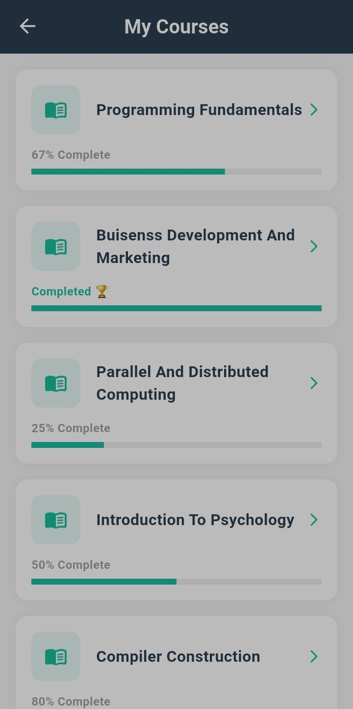

# 🎓 Student Roadmap & Admin Management System

---

## 🚀 Overview
A **Flutter-based mobile application** designed to help educational institutes **structure syllabi and track student progress** when course content is delivered outside the app (classroom sessions, PDFs, videos, etc.).

Instead of hosting learning material, the app focuses on **clarity and accountability** by providing students with a checklist-style roadmap of course outlines, while allowing admins to manage courses, enroll students, and view progress.

🎥 **Demo Video:** https://drive.google.com/file/d/1IYfQ4xl9m7QbBW9zl6sMIQGcMXyT7-on/view?usp=sharing

---

## 📱 Key Features

### 🔹 Student Side (Self-Managed Roadmap)
- **Syllabus Checklist:** Course outlines displayed as interactive checkboxes.
- **Flexible Progress Tracking:** Students can mark outlines as completed or incomplete in any order.
- **Automatic Progress Calculation:** Course completion percentage is calculated based on checked outlines.
- **Visual Progress Indicators:** Progress bars show completion status for each course.
- **My Courses:** View all courses the student is enrolled in.
- **My Profile:** Basic student information screen.

> ⚠️ Progress is **student-managed**. The system does not enforce completion order or validate learning content.

---

### 🔹 Admin Side (Management & Oversight)
- **Course Management:** Create, update, and delete courses.
- **Outline Management:** Define detailed syllabus outlines for each course.
- **Student Enrollment:** Assign students to courses.
- **Progress Visibility:** View self-reported progress of enrolled students.
- **User Management:** Search and filter students efficiently.
- **Access Control:** Activate or deactivate student accounts with a single toggle.

---

## 📸 Screenshots

| Student Dashboard | Progress Tracker | Admin Panel |
|------------------|------------------|-------------|
|  |  |  |

---

## 🛠️ Tech Stack
- **Frontend:** Flutter (Dart)
- **State Management:** GetX
- **Backend:** Firebase (Authentication & Database)
- **Architecture:** MVVM / Clean Architecture
- **Tools:** Android Studio, Git

---

## 💡 Why This Project?
Many Learning Management Systems focus heavily on content delivery (videos, quizzes, assignments). However, in many coaching centers and institutes, teaching happens outside digital platforms.

This project focuses purely on **progress visibility and accountability**:
1. **Clarity:** Students know exactly which topics are completed and which remain.
2. **Structure:** Admins define and manage syllabus outlines centrally.
3. **Visibility:** Both students and admins can clearly see course progress at any time.

---

## 📬 Contact
**Developed by Ayesha Siddiqa**

- **LinkedIn:** https://www.linkedin.com/in/ayesha-siddiqa-85690224b
- **Email:** ayeshasiddiqa1087@gmail.com

---

⭐ If you find this project useful, feel free to star the repository!
